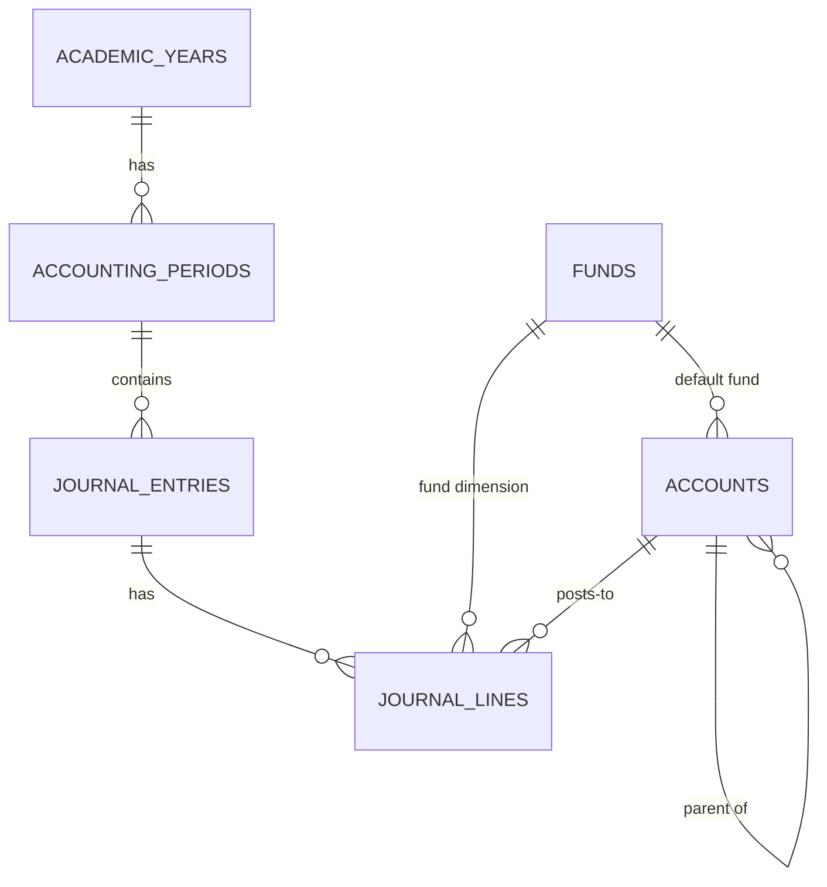
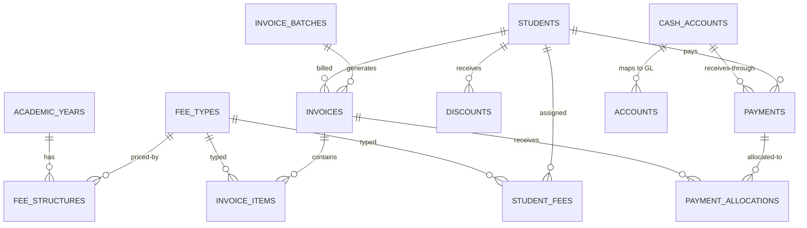
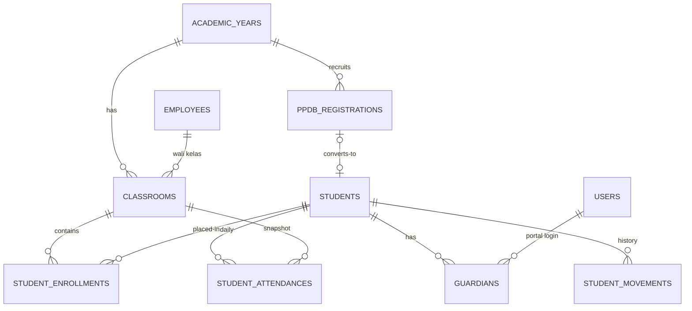
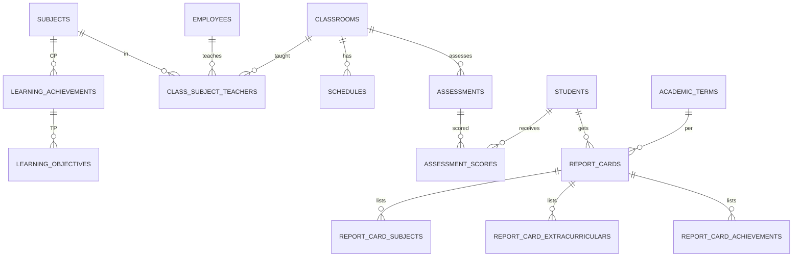
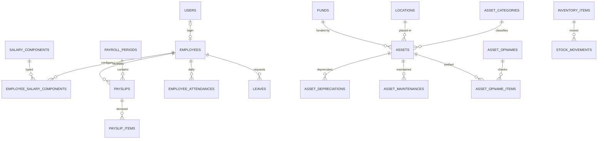

# 02 — Database Schema

Complete table inventory. Conventions (money = BIGINT, string enums, surrogate `id`, FK rules,
soft deletes) are defined in [01-architecture.md](01-architecture.md) and are not repeated per table.

Notation: **U** = unique index, **I** = non-unique index, `*` = soft deletes, `b` = BIGINT money column.
All tables have `id` (bigint PK) and Laravel `timestamps`; only `deleted_at` presence is called out.

---

## 1. Foundation & shared

| Table | Purpose |
|---|---|
| `users` | Login accounts for all staff **and** parents (wali murid) |
| `academic_years` | Tahun ajaran (July–June), e.g. "2026/2027" |
| `academic_terms` | Semester 1 (ganjil) / Semester 2 (genap) per tahun ajaran |
| `funds` | Dana dimension: BOS / Yayasan / Komite / Umum |
| `document_sequences` | Shared number generator for all document types |
| `calendar_days` | Kalender pendidikan: effective days, holidays, exam days |
| `announcements` | School announcements (audience-scoped) — listed under Operations too |

Plus package-owned tables: `roles`, `permissions`, `model_has_roles`, `model_has_permissions`,
`role_has_permissions` (spatie/laravel-permission), `activity_log` (spatie/laravel-activitylog),
`settings` (spatie/laravel-settings), `media` (spatie/laravel-media-library), and Laravel
infrastructure (`jobs`, `job_batches`, `failed_jobs`, `cache`, `cache_locks`, `sessions`,
`password_reset_tokens`).

### `users`
| Column | Type | Notes |
|---|---|---|
| name | string | |
| email | string | **U** |
| email_verified_at | timestamp nullable | |
| password | string | |
| is_active | boolean, default true | deactivated users cannot log in |
| last_login_at | timestamp nullable | |

### `academic_years`
| Column | Type | Notes |
|---|---|---|
| name | string | **U**, format "2026/2027" |
| starts_at | date | July 1 |
| ends_at | date | June 30 (next year) |
| status | string | `AcademicYearStatus`: `planned`,`active`,`closed` |
| is_default | boolean | exactly one active default at a time (service-enforced) |

Creating an academic year auto-seeds its 12 `accounting_periods` and 2 `academic_terms`.

### `academic_terms`
| Column | Type | Notes |
|---|---|---|
| academic_year_id | FK → academic_years | |
| number | tinyint | 1 (ganjil: Jul–Dec), 2 (genap: Jan–Jun) |
| name | string | "Semester 1 — Ganjil" |
| starts_at / ends_at | date | |
| status | string | `TermStatus`: `planned`,`active`,`closed` |

**U**(academic_year_id, number).

### `funds`
| Column | Type | Notes |
|---|---|---|
| code | string(10) | **U**: `BOS`, `YYS`, `KOM`, `UMUM` |
| name | string | "Dana BOS", "Yayasan", "Komite", "Umum/Konsolidasi" |
| type | string | `FundType`: `pemerintah`,`yayasan`,`komite`,`lainnya` |
| description | text nullable | |
| is_active | boolean | |

### `document_sequences`
| Column | Type | Notes |
|---|---|---|
| key | string | `invoice`, `kwitansi`, `journal`, `surat_keluar`, `ppdb`, `asset` |
| period | string | e.g. `2026` (per-year reset) or `2026-07` |
| prefix | string | `KW/2026/` |
| next_number | bigint | |

**U**(key, period). Incremented under `lockForUpdate()` inside the consuming transaction.

### `calendar_days`
| Column | Type | Notes |
|---|---|---|
| date | date | **U** |
| academic_term_id | FK → academic_terms | |
| type | string | `CalendarDayType`: `efektif`,`libur`,`ujian`,`kegiatan` |
| description | string nullable | "Cuti Bersama Idul Fitri" |

---

## 2. Accounting core

| Table | Purpose |
|---|---|
| `accounts` | Chart of accounts (buku besar) |
| `accounting_periods` | Monthly periods per academic year; open/closed |
| `journal_entries` * | Journal header (jurnal umum) |
| `journal_lines` | Journal debit/credit lines |
| `bank_statement_lines` | Imported bank statement rows for reconciliation (roadmap Phase 11) |

### `accounts`
| Column | Type | Notes |
|---|---|---|
| code | char(8) | **U**, e.g. `1-1100` |
| name | string | |
| type | string | `AccountType`: `aset`,`kewajiban`,`ekuitas`,`pendapatan`,`beban` |
| normal_balance | string | `debit` / `kredit` |
| is_header | boolean | header/group row — never postable |
| parent_id | FK → accounts nullable | reporting grouping |
| cash_flow_category | string nullable | `operasi`,`investasi`,`pendanaan`,`non_kas` (drives Arus Kas) |
| default_fund_id | FK → funds nullable | pre-fills fund dimension on posting |
| is_locked | boolean | system accounts cannot be edited/deleted |
| is_active | boolean | |

I(type).

### `accounting_periods`
| Column | Type | Notes |
|---|---|---|
| academic_year_id | FK → academic_years | |
| name | string | **U**, "2026-07" |
| starts_at / ends_at | date | calendar month |
| status | string | `PeriodStatus`: `open`,`closed` |
| closed_at / closed_by (FK users) | nullable | |

I(status). See tutup buku flow in [03-accounting-core.md](03-accounting-core.md).

### `journal_entries` *
| Column | Type | Notes |
|---|---|---|
| number | string | **U**, `JE/2026-07/000318` |
| entry_date | date | determines period |
| accounting_period_id | FK → accounting_periods | |
| description | string | |
| source | string | `manual` / `otomatis` |
| reference_type + reference_id | polymorphic nullable | invoice_batch, payment, payroll_period, asset, asset_depreciation (run), expense/event, … |
| status | string | `JournalStatus`: `posted`,`void` |
| voided_at / voided_reason | nullable | |
| voided_by_entry_id | FK → journal_entries nullable | the mirror reversal entry |
| created_by | FK → users | |

I(entry_date), I(accounting_period_id), I(reference_type, reference_id).

### `journal_lines`
| Column | Type | Notes |
|---|---|---|
| journal_entry_id | FK → journal_entries | **cascadeOnDelete** (only with the entry, which is itself never deleted) |
| account_id | FK → accounts | restrict |
| fund_id | FK → funds nullable | null = yayasan/konsolidasi |
| debit | bigint, default 0 | ≥ 0 |
| credit | bigint, default 0 | ≥ 0 |
| memo | string nullable | |

**U**-none; I(account_id), I(fund_id).
**CHECK constraint**: `debit >= 0 AND credit >= 0 AND NOT (debit > 0 AND credit > 0)`.
No UPDATE/DELETE after the entry is `posted` (service-enforced).

### `bank_statement_lines`
| Column | Type | Notes |
|---|---|---|
| cash_account_id | FK → cash_accounts | restrict |
| statement_date | date | |
| description | string | from the bank statement |
| amount | bigint b | statement sign: inflow positive, outflow negative |
| statement_ref | string nullable | bank reference number |
| status | string | `ReconciliationStatus`: `unmatched`,`matched`,`booked` |
| matched_journal_line_id | FK → journal_lines nullable | |
| booked_journal_entry_id | FK → journal_entries nullable | manual JE booking the difference |
| imported_by | FK → users | |

I(cash_account_id, statement_date); I(status). Design: [03-accounting-core.md](03-accounting-core.md) §7.

---

## 3. Billing & payments

| Table | Purpose |
|---|---|
| `cash_accounts` | Physical kas/bank registers mapped to GL accounts |
| `fee_types` | Jenis biaya (SPP, DSP, …) |
| `fee_structures` | Amount per fee type per grade per academic year |
| `student_fees` | Per-student fee assignment (penetapan biaya) |
| `invoices` * | Tagihan |
| `invoice_items` | Invoice lines: fee positions and discounts (potongan) |
| `invoice_batches` | Monthly SPP batch generation runs |
| `discounts` | Beasiswa/potongan per student |
| `payments` * | Penerimaan (kwitansi) |
| `payment_allocations` | Allocation of a payment across invoices |

### `cash_accounts`
| Column | Type | Notes |
|---|---|---|
| name | string | "Kas Sekolah", "BCA 1234567890" |
| type | string | `kas` / `bank` |
| account_id | FK → accounts | **U** — maps to GL account (1-1100 / 1-1150 / 1-1200) |
| bank_name / account_number | string nullable | |
| is_default_kas / is_default_bank | boolean | defaults on the payment form |
| is_active | boolean | |

### `fee_types`
| Column | Type | Notes |
|---|---|---|
| code | string | **U**: `SPP`, `DSP`, `SERAGAM`, `BUKU`, `KEGIATAN`, `WISUDA` |
| name | string | "Sumbangan Pengembangan Pendidikan (DSP)" |
| category | string | `FeeCategory`: `bulanan`,`tahunan`,`insidental` |
| revenue_account_id | FK → accounts | e.g. 4-1100 |
| is_active | boolean | |

### `fee_structures`
| Column | Type | Notes |
|---|---|---|
| academic_year_id | FK → academic_years | |
| fee_type_id | FK → fee_types | |
| grade_level | tinyint nullable | 1–6; **null = all grades (flat)** |
| fund_id | FK → funds | which fund the revenue belongs to |
| amount | bigint b | |

**U**(academic_year_id, fee_type_id, grade_level).

### `student_fees`
| Column | Type | Notes |
|---|---|---|
| student_id | FK → students | |
| academic_year_id | FK → academic_years | |
| fee_type_id | FK → fee_types | |
| amount | bigint b | may deviate from structure (exception case) |
| months | tinyint | 12 for SPP; 1 for tahunan/insidental |
| first_month | tinyint | SPP starting month (mid-year entrants) |
| is_active | boolean | |

**U**(student_id, academic_year_id, fee_type_id).

### `invoices` *
| Column | Type | Notes |
|---|---|---|
| number | string | **U** `INV/2026-2027/000123` |
| student_id | FK → students | |
| academic_year_id | FK → academic_years | |
| academic_term_id | FK nullable | |
| invoice_batch_id | FK nullable | set when batch-generated |
| invoice_date / due_date | date | |
| period_month | tinyint nullable | SPP month (1–12 mapped to calendar month); null for insidental |
| description | string | |
| status | string | `InvoiceStatus`: `draft`,`issued`,`partially_paid`,`paid`,`void`,`cancelled` |
| total | bigint b | |
| paid_amount | bigint b, default 0 | **derived cache** — written only by `PaymentService` |
| source | string | `batch` / `manual` |
| voided_reason | string nullable | |

I(student_id, status, due_date).

### `invoice_items`
| Column | Type | Notes |
|---|---|---|
| invoice_id | FK → invoices | **cascadeOnDelete** (draft only; issued invoices are immutable) |
| item_type | string | `posisi` (charge) / `potongan` (discount) |
| fee_type_id | FK nullable | on posisi |
| discount_id | FK nullable | on potongan |
| description | string | |
| amount | bigint b | positive; sign comes from item_type |
| revenue_account_id | FK nullable | potongan → expense account 5-1500 |

I(invoice_id).

### `invoice_batches`
| Column | Type | Notes |
|---|---|---|
| academic_year_id | FK → academic_years | |
| fee_type_id | FK → fee_types | |
| period_month | tinyint nullable | |
| grade_filter | tinyint nullable | |
| total_invoices / total_amount | integer / bigint b | |
| status | string | `draft`,`issued`,`void` |
| generated_by | FK → users | |
| generated_at | timestamp | |
| journal_entry_id | FK nullable | posted at **Terbitkan** |

**U**(academic_year_id, fee_type_id, period_month).

### `discounts`
| Column | Type | Notes |
|---|---|---|
| student_id | FK → students | |
| academic_year_id | FK → academic_years | |
| fee_type_id | FK nullable | null = all fee types |
| name | string | "Beasiswa Prestasi", "Potongan Anak Guru" |
| type | string | `percent` / `fixed` |
| value | bigint b | percent (0–100) or fixed rupiah per invoice |
| start_month / end_month | tinyint | applicability window |
| is_active | boolean | |
| approved_by | FK → users | |

I(student_id).

### `payments` *
| Column | Type | Notes |
|---|---|---|
| number | string | **U** kwitansi number `KW/2026/000042` — never reused |
| student_id | FK → students | |
| payment_date | date | |
| method | string | `PaymentMethod`: `tunai`,`transfer`,`qris`,`ewallet`,`lainnya` |
| cash_account_id | FK → cash_accounts | which register received the money |
| amount | bigint b | total received |
| reference | string nullable | reserved for future gateway (Midtrans) reference |
| received_by | FK → users | |
| notes | string nullable | |
| journal_entry_id | FK nullable | posted payment JE |
| reversed_by_payment_id | FK self nullable | reversal payment (void flow) |

I(student_id, payment_date).

### `payment_allocations`
| Column | Type | Notes |
|---|---|---|
| payment_id | FK → payments | **cascadeOnDelete** |
| invoice_id | FK → invoices | restrict |
| amount | bigint b | |
| allocated_by | FK → users | |

**U**(payment_id, invoice_id); I(invoice_id).
Invariants (service-enforced): Σ allocations ≤ payment.amount; per invoice Σ allocations ≤ invoice.total;
allocations only against `issued`/`partially_paid` invoices.

---

## 4. HR & payroll

| Table | Purpose |
|---|---|
| `employees` * | Guru & karyawan |
| `salary_components` | Salary component master (earnings/deductions) with GL mapping |
| `employee_salary_components` | Component configuration per employee |
| `payroll_periods` | Monthly payroll cycle |
| `payslips` | Per employee per period |
| `payslip_items` | Payslip lines |
| `employee_attendances` | Daily staff attendance |
| `leaves` | Izin / cuti / sakit with approval |

### `employees` *
| Column | Type | Notes |
|---|---|---|
| user_id | FK → users nullable **U** | one login per employee |
| employee_no | string | **U** |
| name | string | |
| nik | string nullable | **U** |
| gender | string | `L` / `P` |
| birth_place / birth_date | string / date | |
| address | text | |
| phone | string | |
| position | string | jabatan: "Guru Kelas", "Operator", "Penjaga" |
| employment_status | string | `EmploymentStatus`: `pns`,`pppk`,`tetap`,`honorer`,`bsm` |
| is_teaching | boolean | |
| join_date / end_date | date / date nullable | |
| marital_status | string nullable | |
| bank_name / bank_account_no | string nullable | payroll transfer target |
| bpjs_kesehatan_no / bpjs_ketenagakerjaan_no | string nullable | |
| npwp_no | string nullable | |
| base_salary | bigint b | reference only — payroll always computes from components |
| is_active | boolean | |

### `salary_components`
| Column | Type | Notes |
|---|---|---|
| code | string | **U**: `GAJI_POKOK`, `TUNJ_TRANSPORT`, `BPJS_KES_PEG`, … |
| name | string | |
| type | string | `pendapatan` / `potongan` |
| calculation | string | `fixed` / `percent_base` (percent of gaji pokok) / `manual_entry` |
| default_amount | bigint b | fixed rupiah, or percent ×100 stored as e.g. 100 = 1% (see 05) |
| percent_rate | decimal(5,4) nullable | for percent_base components (0.0100 = 1%) |
| is_employer | boolean | employer-paid BPJS (earnings to employee's slip, cost to school) |
| gl_account_id | FK → accounts | expense account for earnings (5-11xx) |
| liability_account_id | FK → accounts nullable | utang account for deductions (2-11xx/2-12xx/2-13xx) |
| is_active | boolean | |

### `employee_salary_components`
| Column | Type | Notes |
|---|---|---|
| employee_id | FK → employees | |
| salary_component_id | FK → salary_components | |
| amount | bigint b | fixed amount for this employee |
| percent_rate | decimal(5,4) nullable | override |
| is_active | boolean | |

**U**(employee_id, salary_component_id).

### `payroll_periods`
| Column | Type | Notes |
|---|---|---|
| name | string | **U** "Payroll 2026-07" |
| period_month / period_year | tinyint / smallint | |
| status | string | `PayrollStatus`: `draft`,`calculated`,`approved`,`paid`,`cancelled` |
| total_gross / total_deductions / total_net | bigint b | |
| calculated_at | timestamp nullable | |
| approved_at / approved_by | nullable / FK users | |
| paid_at | timestamp nullable | |
| journal_entry_id | FK nullable | accrual JE (on approve) |
| payment_journal_entry_id | FK nullable | payment JE (on pay) |

### `payslips`
| Column | Type | Notes |
|---|---|---|
| payroll_period_id | FK → payroll_periods | **cascadeOnDelete** (while draft/calculated only) |
| employee_id | FK → employees | restrict |
| base_salary | bigint b | snapshot |
| total_earnings / total_deductions / net_salary | bigint b | |
| days_present / days_sick / days_leave / days_absent | tinyint | attendance snapshot |
| notes | string nullable | |

**U**(payroll_period_id, employee_id).

### `payslip_items`
| Column | Type | Notes |
|---|---|---|
| payslip_id | FK → payslips | **cascadeOnDelete** |
| salary_component_id | FK | |
| type | string | `pendapatan` / `potongan` |
| amount | bigint b | |
| description | string nullable | e.g. "Honor 12 JP" |

I(payslip_id).

### `employee_attendances`
| Column | Type | Notes |
|---|---|---|
| employee_id | FK → employees | |
| date | date | |
| check_in / check_out | time nullable | |
| status | string | `EmployeeAttendanceStatus`: `hadir`,`terlambat`,`izin`,`sakit`,`dinas_luar`,`cuti`,`alpa` |
| notes | string nullable | |

**U**(employee_id, date).

### `leaves`
| Column | Type | Notes |
|---|---|---|
| employee_id | FK → employees | |
| type | string | `LeaveType`: `izin`,`sakit`,`cuti`,`dinas` |
| start_date / end_date | date | |
| days | tinyint | |
| reason | text | |
| status | string | `menunggu`,`disetujui`,`ditolak` |
| approved_by / approved_at | FK users / timestamp nullable | |

I(employee_id, status).

---

## 5. Students & enrollment

| Table | Purpose |
|---|---|
| `students` * | Student master data |
| `guardians` | Wali (ayah/ibu/wali) per student; portal login link |
| `classrooms` | Rombel per academic year |
| `student_enrollments` | Student placement per academic year |
| `student_movements` | Kenaikan / lulus / mutasi audit trail |
| `student_attendances` | Daily attendance (H/S/I/A) |
| `ppdb_registrations` | New-student registration (PPDB) |

### `students` *
| Column | Type | Notes |
|---|---|---|
| nis | string | **U** internal number (required) |
| nisn | string nullable | **U** national 10-digit |
| nik | string nullable | **U** 16-digit |
| full_name | string | |
| gender | string | `L` / `P` |
| birth_place / birth_date | string / date | |
| religion | string | `Religion`: `islam`,`kristen`,`katolik`,`hindu`,`buddha`,`konghucu` |
| address | text | |
| kk_no / akta_no | string nullable | family card / birth certificate |
| phone | string nullable | |
| photo | media library | singleFile collection |
| status | string | `StudentStatus`: `aktif`,`lulus`,`mutasi_keluar`,`keluar`,`cadangan` |
| entry_date / exit_date | date / date nullable | |
| exit_reason | string nullable | |

I(status), I(full_name).

### `guardians`
| Column | Type | Notes |
|---|---|---|
| student_id | FK → students | **cascadeOnDelete** |
| relationship | string | `GuardianRelation`: `ayah`,`ibu`,`wali` |
| name | string | |
| nik | string nullable | |
| occupation | string nullable | |
| education | string nullable | `sd`,`smp`,`sma`,`d1`–`d4`,`s1`,`s2`,`s3` |
| phone | string | |
| email | string nullable | |
| is_primary_contact | boolean | |
| user_id | FK → users nullable | **plain index (NOT unique)** — one parent account may be guardian on several students' rows; children resolved via this relation |

**U**(student_id, relationship); I(user_id).

### `classrooms`
| Column | Type | Notes |
|---|---|---|
| academic_year_id | FK → academic_years | |
| name | string | "1A", "5B" — **U**(academic_year_id, name) |
| grade_level | tinyint | 1–6 |
| fase | string | `A` / `B` / `C` (derived from grade, stored for query speed) |
| homeroom_teacher_id | FK → employees nullable | wali kelas |
| location_id | FK → locations nullable | |
| capacity | tinyint nullable | |
| is_active | boolean | |

### `student_enrollments`
| Column | Type | Notes |
|---|---|---|
| student_id | FK → students | |
| academic_year_id | FK → academic_years | |
| classroom_id | FK → classrooms | |
| grade_level | tinyint | snapshot |
| status | string | `EnrollmentStatus`: `aktif`,`pindah`,`keluar`,`lulus` |

**U**(student_id, academic_year_id); I(classroom_id).

### `student_movements`
| Column | Type | Notes |
|---|---|---|
| student_id | FK → students | |
| academic_year_id | FK → academic_years | |
| type | string | `MovementType`: `kenaikan`,`tinggal_kelas`,`lulus`,`mutasi_masuk`,`mutasi_keluar`,`keluar` |
| from_classroom_id / to_classroom_id | FK nullable | |
| movement_date | date | |
| notes | string nullable | |
| registered_by | FK → users | |

I(student_id, type). Single audit trail for all placement changes (no separate promotions table).

### `student_attendances`
| Column | Type | Notes |
|---|---|---|
| student_id | FK → students | |
| classroom_id | FK → classrooms | snapshot of the day's class |
| date | date | |
| status | string | `StudentAttendanceStatus`: `hadir`,`sakit`,`izin`,`alpa` |
| recorded_by | FK → users | |
| notes | string nullable | |

**U**(student_id, date); I(classroom_id, date).

### `ppdb_registrations`
| Column | Type | Notes |
|---|---|---|
| registration_no | string | **U** `PPDB/2026/000087` |
| academic_year_id | FK → academic_years | |
| applicant_name | string | |
| gender | string | `L` / `P` |
| birth_place / birth_date | string / date | |
| origin_tk | string nullable | asal TK/PAUD |
| address | text | |
| father_name / mother_name | string | |
| parent_phone | string | |
| status | string | `PpdbStatus`: `baru`,`verifikasi`,`diterima`,`cadangan`,`ditolak`,`terdaftar` |
| registered_at | timestamp | |
| verified_by | FK → users nullable | |
| converted_student_id | FK → students nullable | set on acceptance |
| notes | text nullable | |

---

## 6. Academics & Kurikulum Merdeka

| Table | Purpose |
|---|---|
| `subjects` | Mata pelajaran |
| `class_subject_teachers` | Pengampu mapel per rombel |
| `schedules` | Weekly lesson schedule |
| `learning_achievements` | CP (Capaian Pembelajaran) per subject × fase |
| `learning_objectives` | TP (Tujuan Pembelajaran) under each CP |
| `teacher_learning_journals` | Jurnal mengajar |
| `assessments` | Penilaian (formatif/sumatif) |
| `assessment_scores` | Student scores per assessment |
| `report_cards` * | Rapor per student per semester |
| `report_card_subjects` | Per-subject final score + deskripsi |
| `extracurriculars` | Master ekstrakurikuler |
| `report_card_extracurriculars` | Ekstrakurikuler entries on rapor |
| `report_card_achievements` | Prestasi entries on rapor |

### `subjects`
| Column | Type | Notes |
|---|---|---|
| code | string | **U**: `MTK`, `BIN`, `BIG`, `PAI`, `PJOK`, `SBDP`, `BING`, `IPA`, `PKN` |
| name | string | |
| kelompok | string | `A` / `B` (Kurikulum Merdeka grouping) |
| jp_per_week | tinyint | jam pelajaran |
| is_active | boolean | |

### `class_subject_teachers`
| Column | Type | Notes |
|---|---|---|
| classroom_id | FK → classrooms | |
| subject_id | FK → subjects | |
| teacher_id | FK → employees | |
| jp_per_week | tinyint nullable | |

**U**(classroom_id, subject_id).

### `schedules`
| Column | Type | Notes |
|---|---|---|
| classroom_id | FK → classrooms | |
| subject_id | FK → subjects | |
| teacher_id | FK → employees | |
| academic_term_id | FK → academic_terms | |
| day | string | `senin`…`sabtu` |
| start_time / end_time | time | |

**U**(classroom_id, day, start_time).

### `learning_achievements` (CP)
| Column | Type | Notes |
|---|---|---|
| subject_id | FK → subjects | |
| fase | string | `A` / `B` / `C` |
| elemen | string | e.g. "Bilangan", "Literasi" |
| code | string | **U**(subject_id, fase, code) |
| description | text | from BSKAP CP documents |
| is_active | boolean | |

### `learning_objectives` (TP)
| Column | Type | Notes |
|---|---|---|
| learning_achievement_id | FK → learning_achievements | |
| code | string | **U**(learning_achievement_id, code) |
| description | text | authored by teachers |
| semester | tinyint | 1 / 2 |
| sequence | tinyint | teaching order |

### `teacher_learning_journals`
| Column | Type | Notes |
|---|---|---|
| classroom_id | FK → classrooms | |
| subject_id | FK → subjects | |
| teacher_id | FK → employees | |
| date | date | |
| learning_objective_id | FK nullable | TP covered |
| topic | string | |
| method | string nullable | |
| notes | text nullable | |

I(classroom_id, date).

### `assessments`
| Column | Type | Notes |
|---|---|---|
| classroom_id | FK → classrooms | |
| subject_id | FK → subjects | |
| teacher_id | FK → employees | |
| academic_term_id | FK → academic_terms | |
| name | string | "Sumatif Tengah Semester" |
| type | string | `formatif`,`sumatif`,`sumatif_akhir` |
| dimension | string | `pengetahuan`,`keterampilan` |
| assessment_date | date | |
| max_score | decimal(5,2), default 100 | |
| learning_objective_id | FK nullable | TP link |

I(classroom_id, academic_term_id, type).

### `assessment_scores`
| Column | Type | Notes |
|---|---|---|
| assessment_id | FK → assessments | **cascadeOnDelete** |
| student_id | FK → students | |
| score | decimal(5,2) nullable | numeric path |
| predicate | string nullable | rubric path (Fase A): `BB`,`MB`,`BSH`,`SB` |
| note | string nullable | |

**U**(assessment_id, student_id). One of score/predicate must be present (service validation).

### `report_cards` *
| Column | Type | Notes |
|---|---|---|
| student_id | FK → students | |
| classroom_id | FK → classrooms | snapshot |
| academic_term_id | FK → academic_terms | |
| status | string | `ReportCardStatus`: `draft`,`diajukan`,`revisi`,`disetujui`,`diterbitkan` |
| revision_note | text nullable | from kepala sekolah on `revisi` |
| catatan_wali_kelas | text nullable | |
| days_sick / days_izin / days_alpa | tinyint | attendance snapshot |
| height_cm / weight_kg | decimal nullable | pertumbuhan (cm / kg) |
| submitted_at / reviewed_at | timestamp nullable | |
| approved_at / approved_by | nullable / FK users | |
| published_at / published_by | nullable / FK users | |

**U**(student_id, academic_term_id).

### `report_card_subjects`
| Column | Type | Notes |
|---|---|---|
| report_card_id | FK → report_cards | **cascadeOnDelete** |
| subject_id | FK → subjects | |
| final_score | decimal(5,2) | computed 40/60 (see 06) |
| predicate | string | `BB`,`MB`,`BSH`,`SB` |
| description | text | auto-drafted, teacher-editable |

**U**(report_card_id, subject_id).

### `extracurriculars`
| Column | Type | Notes |
|---|---|---|
| name | string | **U** "Pramuka", "Marawis" |
| description | string nullable | |
| is_active | boolean | |

### `report_card_extracurriculars`
| Column | Type | Notes |
|---|---|---|
| report_card_id | FK → report_cards | **cascadeOnDelete** |
| extracurricular_id | FK → extracurriculars | |
| predicate | string | `BB`,`MB`,`BSH`,`SB` |
| description | string nullable | |

**U**(report_card_id, extracurricular_id).

### `report_card_achievements`
| Column | Type | Notes |
|---|---|---|
| report_card_id | FK → report_cards | **cascadeOnDelete** |
| name | string | "Juara 1 MTQ Kecamatan" |
| type | string | `akademik` / `non_akademik` |
| level | string | `sekolah`,`kecamatan`,`kabupaten`,`provinsi`,`nasional` |
| rank | tinyint nullable | |
| description | string nullable | |

---

## 7. Assets & inventory

| Table | Purpose |
|---|---|
| `asset_categories` | Kelompok aset with GL mapping |
| `locations` | Ruang / lokasi |
| `assets` * | Asset register — one row = one physical unit |
| `asset_depreciations` | Monthly depreciation per asset |
| `asset_maintenances` | Perawatan / perbaikan |
| `asset_opnames` | Opname runs |
| `asset_opname_items` | Opname results per asset |
| `inventory_items` | Consumables (ATK) master |
| `stock_movements` | Consumable stock in/out |

### `asset_categories`
| Column | Type | Notes |
|---|---|---|
| code | string | **U**: `PERL`,`MBL`,`BUKU`,`GED`,`TNH`,`ELK` |
| name | string | "Peralatan & Mesin", "Meubelair" |
| useful_life_months | smallint nullable | default for category |
| asset_account_id | FK → accounts | 1-2100…1-2500 |
| is_depreciable | boolean | tanah = false |

### `locations`
| Column | Type | Notes |
|---|---|---|
| code | string | **U** |
| name | string | "Ruang Kelas 1A", "Kantor Guru", "Perpustakaan" |
| building | string nullable | |
| parent_id | FK self nullable | building → floor → room if needed |

### `assets` *
| Column | Type | Notes |
|---|---|---|
| code | string | **U** `INV-Aset/2026/000007` (printed label) |
| name | string | |
| asset_category_id | FK → asset_categories | |
| acquisition_date | date | |
| acquisition_cost | bigint b | |
| fund_id | FK → funds | funding dimension |
| funding_source | string | `bos`,`yayasan`,`komite`,`hibah` (label detail; fund_id is the accounting dimension) |
| brand_model / serial_no | string nullable | |
| condition | string | `baik`,`rusak_ringan`,`rusak_berat` |
| location_id | FK → locations | |
| custodian_id | FK → employees nullable | penanggung jawab |
| status | string | `AssetStatus`: `aktif`,`dijual`,`dihapuskan`,`hilang` |
| useful_life_months | smallint nullable | override of category default |
| salvage_value | bigint b, default 0 | |
| disposal_date | date nullable | |
| disposal_method | string nullable | `dijual`,`dihapuskan`,`hilang` |
| disposal_proceeds | bigint b, default 0 | |
| journal_entry_id | FK nullable | acquisition JE |
| disposal_journal_entry_id | FK nullable | disposal JE |
| notes | text nullable | |

I(status), I(location_id).

### `asset_depreciations`
| Column | Type | Notes |
|---|---|---|
| asset_id | FK → assets | |
| accounting_period_id | FK → accounting_periods | |
| amount | bigint b | |
| accumulated_amount | bigint b | running total after this run |
| journal_entry_id | FK → journal_entries | per-run JE shared by all lines of the run |

**U**(asset_id, accounting_period_id) — makes runs idempotent.

### `asset_maintenances`
| Column | Type | Notes |
|---|---|---|
| asset_id | FK → assets | |
| maintenance_date | date | |
| type | string | `perawatan` / `perbaikan` |
| description | string | |
| cost | bigint b | expensed to 5-1800 (never capitalized) |
| vendor | string nullable | |
| journal_entry_id | FK nullable | |

### `asset_opnames`
| Column | Type | Notes |
|---|---|---|
| name | string | "Opname Semester 1 2026" |
| opname_date | date | |
| conducted_by | FK → users | |
| notes | text nullable | |

### `asset_opname_items`
| Column | Type | Notes |
|---|---|---|
| asset_opname_id | FK → asset_opnames | **cascadeOnDelete** |
| asset_id | FK → assets | |
| found | boolean | |
| condition | string nullable | re-confirmed condition |
| notes | string nullable | |

**U**(asset_opname_id, asset_id).

### `inventory_items`
| Column | Type | Notes |
|---|---|---|
| code | string | **U** |
| name | string | "Kertas HVS A4" |
| unit | string | `pcs`,`rim`,`box`,`lusin` |
| current_stock | decimal(10,2) | |
| min_stock | decimal(10,2), default 0 | low-stock alert |
| avg_cost | bigint b | weighted-average unit cost |
| is_active | boolean | |

### `stock_movements`
| Column | Type | Notes |
|---|---|---|
| inventory_item_id | FK → inventory_items | |
| movement_date | date | |
| type | string | `masuk` / `keluar` |
| quantity | decimal(10,2) | |
| unit_cost | bigint b | at movement time |
| total_cost | bigint b | |
| purpose | string nullable | destination/purpose for keluar |
| requester_id | FK → users nullable | |
| journal_entry_id | FK nullable | purchase (Dr 1-1400) / issuance (Dr 5-14xx) JE |

I(inventory_item_id, movement_date).

---

## 8. Operations

| Table | Purpose |
|---|---|
| `rkas_items` | Annual budget plan per fund × expense account × activity |
| `incoming_letters` | Surat masuk |
| `outgoing_letters` | Surat keluar |
| `meetings` | Rapat |
| `meeting_attendees` | Peserta rapat |
| `events` | Kegiatan sekolah with budget |
| `announcements` | Pengumuman (audience-scoped) |

### `rkas_items`
| Column | Type | Notes |
|---|---|---|
| academic_year_id | FK → academic_years | |
| fund_id | FK → funds | |
| account_id | FK → accounts | expense account (5-xxxx) |
| activity_name | string | kegiatan: "Pengadaan ATK Semester 1" |
| planned_amount | bigint b | |
| notes | text nullable | |

**U**(academic_year_id, account_id, fund_id, activity_name).
Realization is **never cached** — computed live as Σ journal_lines matching (account, fund, academic-year periods).

### `incoming_letters`
| Column | Type | Notes |
|---|---|---|
| agenda_no | string | **U** per year (sequence) |
| letter_no | string | nomor asal (from sender) |
| received_date | date | |
| sender | string | |
| subject | string | |
| letter_type | string | `undangan`,`edaran`,`permohonan`,`keputusan`,`lainnya` |
| destination | string nullable | ditujukan kepada |
| disposition | text nullable | disposisi |
| status | string | `baru`,`diproses`,`selesai` |
| archived_at | timestamp nullable | |
| scan media | media library | singleFile |

### `outgoing_letters`
| Column | Type | Notes |
|---|---|---|
| letter_no | string | **U** `SK/2026/000015` |
| letter_date | date | |
| recipient | string | |
| subject | string | |
| body | text | |
| signed_by_id | FK → employees | kepala sekolah |
| status | string | `draft`,`ditandatangani`,`terkirim` |

### `meetings`
| Column | Type | Notes |
|---|---|---|
| title | string | |
| meeting_date | date | |
| start_time | time | |
| location | string | |
| organizer_id | FK → employees | |
| agenda | text | |
| minutes | text nullable | notulen (rich text) |
| status | string | `terjadwal`,`terlaksana`,`dibatalkan` |

### `meeting_attendees`
| Column | Type | Notes |
|---|---|---|
| meeting_id | FK → meetings | **cascadeOnDelete** |
| employee_id | FK nullable | staff attendee |
| guest_name | string nullable | external attendee |
| attended | boolean, default false | |

**U**(meeting_id, employee_id, guest_name) — at least one of employee/guest present.

### `events`
| Column | Type | Notes |
|---|---|---|
| name | string | "Study Tour Kelas 4" |
| type | string | `kegiatan_siswa`,`rapat_besar`,`sosialisasi`,`lainnya` |
| start_date / end_date | date | |
| location | string | |
| description | text | |
| fund_id | FK → funds | |
| budget_amount | bigint b | |
| realized_amount | bigint b | **cache only**, recomputed from journal lines referencing the event |
| status | string | `rencana`,`berlangsung`,`selesai`,`dibatalkan` |

### `announcements`
| Column | Type | Notes |
|---|---|---|
| title | string | |
| body | text | |
| audience | string | `semua`,`guru`,`wali_murid` |
| publish_at | timestamp | scheduled publish |
| expires_at | timestamp nullable | |
| is_pinned | boolean | |
| published_by | FK → users | |
| status | string | `draft` / `terbit` |

Also delivered as Laravel database notifications on publish.

---

## 9. Table count

App tables: 6 (foundation) + 5 (accounting) + 10 (billing) + 8 (HR) + 7 (students) + 13 (academics)
+ 9 (assets) + 7 (operations) = **65 application tables** + ~15 package/infrastructure tables ≈ **80 total**.

---

## 10. Module ERDs

### Accounting + Funds

### Billing

### Students

### Academics

### HR & Assets

